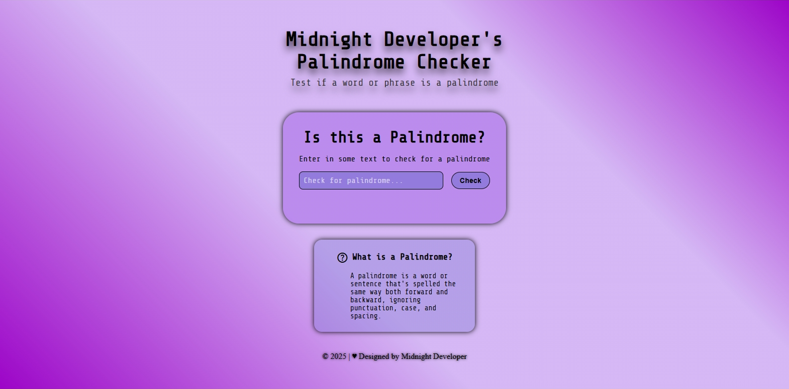

# 💼 Midnight Developers Palindrome Checker

## 📖 Overview
Created as part of my FreeCodeCamp Responsive Web Design Certification. This project is a fully responsive palindrome checker built with HTML, CSS, and JavaScript.

Designed under my developer alias Midnight Developer, this project demonstrates functional logic with a visually distinctive, accessible layout. Users can enter a word or phrase to instantly check whether it qualifies as a palindrome, with results displayed dynamically on the page.

The application features a clear header and subtitle, an interactive input and validation system, an educational explanation of palindromes, and a styled footer. All wrapped in a clean, responsive design that adapts smoothly across screen sizes.

## ✨ Features
- Interactive palindrome checker with real-time validation
- Cleans user input to ignore punctuation, spacing, and letter case
- Displays clear success or failure messages dynamically
- Responsive layout optimized for desktop and mobile devices
- Accessible input and button interactions with hover and focus states
- Educational section explaining what a palindrome is
- Custom visual styling using gradients, shadows, and monospace typography

## 🛠️ Built With
- HTML – structure
- CSS – styling
- JavaScript – logic and interactivity

## 🧰 Skills Demonstrated
- Semantic HTML structure and accessibility best practices
- Responsive layout techniques using Flexbox and media queries
- Custom CSS styling, transitions, and hover/focus states
- JavaScript DOM manipulation and event handling
- String manipulation and regular expressions
- Input validation and user feedback handling
- Project organization and clean code practices

## 🚀 How to Use
[`View Live Project`](https://midnight-developer-ts.github.io/midnight-developers-palindrome-checker/)

1. Enter a word or phrase into the input field
2. Click or press **Check** 
3. View the palindrome result displayed below
4. Resize the browser window to see responsive layout adjustments.
5. Hover over the **Midnight Developer** name in the footer
6. Click the developer name to view additional info and links on Linktree

## 📂 Project Structure
portfolio-project/ | `root folder`

│── index.html | `main webpage`

│── css/ | `styling folder`

│   └── styles.css | `styling`

│── images/ | `images folder`

│   └── website-favicon.png | `favicon`

│   └── website-preview.png | `preview image`

│── LICENSE | `license details`

│── README.md | `project details`

## 📌 Learning Goals
- Practice building a complete interactive webpage from scratch
- Strengthen understanding of JavaScript string methods and logic flow
- Apply responsive design principles to real-world layouts
- Improve accessibility and usability through semantic markup and UI feedback
- Reinforce clean separation of structure (HTML), styling (CSS), and behavior (JavaScript)
- Gain confidence creating certification ready projects with personal branding

## 🎯 Certification Compliance
This project fully meets all FreeCodeCamp Responsive Web Design
Technical Documentation Page user stories and requirements.

## 📸 Preview

[`View Live Project`](https://midnight-developer-ts.github.io/midnight-developers-palindrome-checker/)

## 📄 License 
This project is provided for portfolio and educational review only. 
Copying, redistribution, or commercial use is prohibited. 

This project is licensed under a Midnight Developer Proprietary License. 
See the [LICENSE](https://github.com/Midnight-Developer-ts/midnight-developers-palindrome-checker/blob/main/LICENSE) file for full terms.
